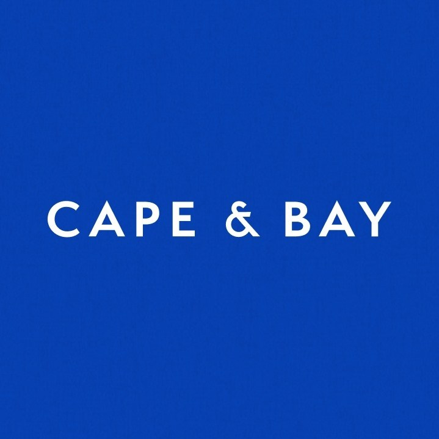

# 

> ### Portal Dev

The cake is usually the truth when you buy it from the store and it's sitting on your counter waiting for you to sink the knife into it while thinking about how GlaDOS was a gd liar.

----------
# Getting started

## Installation

Clone the repository

    git clone git@bitbucket.org:capeandbaytrufit/candidate-assessment-upload-portal.git.

Switch to the repo folder

    cd dev/capeandbay/portal_dev

Install all the PHP dependencies using composer

    composer install

Install all the JS dependencies using npm

    npm install && npm run dev

Copy the example env file and make the required configuration changes in the .env file

    cp .env.example .env

Generate a new application key

    php artisan key:generate

Run the database migrations (**Set the database connection in .env before migrating**)

    php artisan migrate

Start the local development server

    php artisan serve

You should now be able to access the server at http://localhost:8000

